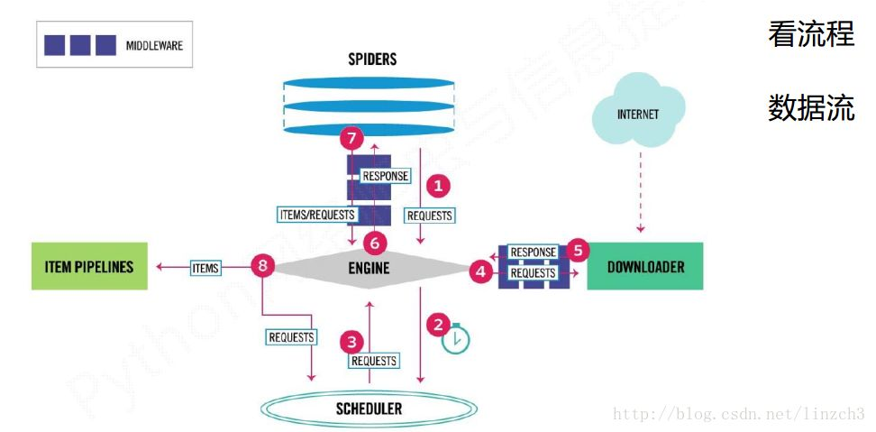

## IMDB_Spider_By_Scrapy
This project crawls IMDb top 250 movies information by using Scrapy which is a "powerful web crawlling framework" with python.

### Structure
> spiders/IMDb_spider.py # parse crawled website into scrapy items

> movie_item.py
>   * MovieItem # Movie Item class
>   * MovieReview # Review Item for each Movie
>   * MovieStar # Movie star Item

> pipelines.py 
>   * handle the two items for saving to separated files
>   * Transfer item object to python dictionary(essentially they are same.)

> Outputs:(I didn't upload it to Git.)
>   * MovieItem.csv # save Movie Items
>   * MovieReview.csv # save Movie Reviews
>   * MovieStar.csv # save Movie star info

> spiders/settings.py
```python
# set for pipelines
ITEM_PIPELINES = {
   'IMDB_Spider.pipelines.Pipeline': 300,
}
```

### How to use
Use console to the project folder, then run "scrapy crawl imdbspider", where `imdbspider` is project name which you can find in `IMDb_spider.py`.
```python
name = 'imdbspider'
allowed_domains = ['imdb.com']
start_urls = ['http://www.imdb.com/chart/top',]
```

### How scrapy works

1. Engine gets request object from spiders(IMDb_spider.py)
2. Engine handles request object to scheduler
3. Engine gets next request from scheduler
4. Engine sends the request to downloader through middleware
5. Downloader sends response back to engine through middleware
6. Engine transfers response to spider for parsing
7. Spider creates scrapy Items and sends new request to Engine
8. Engine sends Items to pipelines
In this process, Engine will receive request from scheduler until it is emtpy. Framewrok starts with `start_url`, end with `pipelines`. 
Enigne, Downloader and Scheduler are already completed by framework. we need to code spiders and pipelines, also do
some configure stuffs.

### Some commands in scrapy
startproject: create a new project

genspider: create a spider

setting: get spider config info

crawl: start to run crawling

list: show all project names

shell: start URL parse